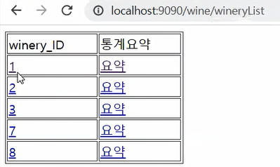
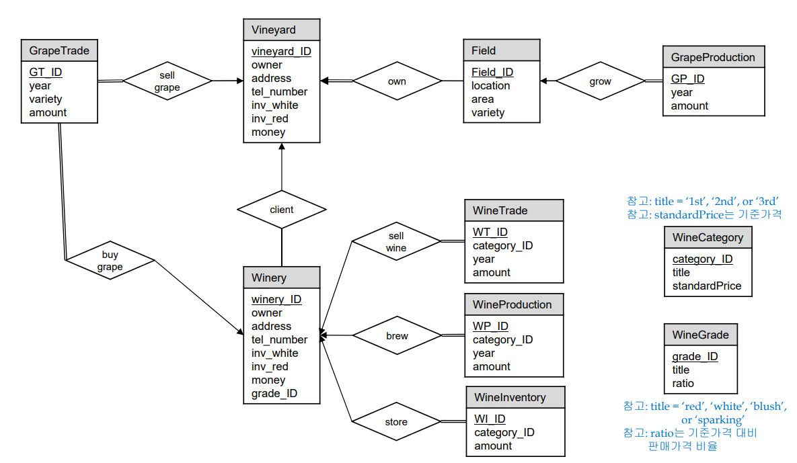

# 0. 메인페이지

입력기능, 포도농장관리, 와이너리관리 링크

# 1. 입력기능

크게 새로운 밭 등록, 새로운 포도농장 등록, 새로운 와인 양조장 등록, 와인종류 테이블 정보 등록, 와인 등급테이블 정보 등록 링크

## 1-1 새로운 밭 등록

* 포도밭 정보 등록
  * 포도밭 ID (Primary Key)
  * 지역
  * 면적
  * 포도 품종

* 등록 알림
* 확인 누르면 포도밭 정보 등록 페이지로 이동

 

## 1-2 새로운 포도농장 등록

* 포도농장 정보 등록
  * 소유가능한 밭 : 다수 선택 가능한 체크박스로 구현
  * 포도농장 ID (Primary Key)
  * 주인
  * 주소
  * 전화번호
  * 소유 재산

* 등록 알림
* 확인 누르면 포도농장 정보 등록 페이지로 이동

 

## 1-3 새로운 와인 양조장 등록

* 와인 양조장 정보 등록
  * 거래 가능한 포도 농장 : 와인 양조장은 하나의 포도농장만 거래 가능하다는 설정을 구현하기 위해서 라디오버튼으로 구현
  * 와인 양조장 ID
  * 주인
  * 주소
  * 전화번호
  * 소유 재산
  * 생산와인 등급

* 등록 알림
* 확인 누르면 와인 양조장 정보 등록 페이지로 이동

## 1-4 와인종류테이블 정보 등록

* 와인 종류 정보 등록
  * 와인 종류 ID(Primary Key)
  * 와인 이름
  * 표준 가격

* 등록 알림
* 확인 누르면 와인종류 정보 등록 페이지로 이동

## 1-5 와인등급테이블 정보 등록

* 와인등급 정보 등록
  * 와인 등급
  * 와인 종류
  * 표준가격과의 배율

* 등록 알림
* 확인 누르면 와인등급 정보 등록 페이지로 이동

# 2. 포도농장 관리

포도농장 리스트 출력, 밭 정보 관리, 새로운 포도밭 구매 링크

## 2-1 포도농장 목록 출력

* 모든 포도농장 기본 정보 출력
* 포도농장 상세 정보 : vineyard_ID에 링크
* 포도농장 요약정보 링크

### 2-1-1 포도농장 상세 정보

* 해당 포도농장 상세 정보 출력
  * 포도농장 ID
  * 주인
  * 주소
  * 전화번호
  * 포도별 재고량(화이트, 레드)
  * 소유재산
  * 올해 포도 생산량
  * 소유한 포도 밭 목록
  * 수정 링크

#### 2-1-1-1 해당 포도 밭 정보 수정

* 등록한 값 가져오기
* 수정 : 버튼 누르면 수정됨

* 수정 알림

* 확인 클릭 후 상세정보 페이지로 이동

### 2-1-2 포도농장 요약정보

 

* 해당 포도농장 요약정보 출력
  * 총 밭 면적
  * 총 포도 생산량
  * 포도 거래량

## 2-2 포도 밭 관리

* 포도 밭 ID에 링크

### 2-2-1 해당 포도 밭 상세정보 출력

* 해당 포도 밭 수정 링크
* 해당 포도 밭에서 생산 링크
* 행당 포도 밭 생산내역 수정 링크

#### 2-2-1-1 해당 포도 밭 정보 수정

* 해당 포도 밭 정보 갸져오기
* 수정 : 버튼 누르면 수정됨

* 수정 알림
* 확인 누르면 포도 밭 목록 페이지로 이동

#### 2-2-1-2 해당 포도밭에서 포도 생산

* 생산 포도 정보 등록 : 등록 버튼 누르면 등록됨
  * 포도 품종
  * 생산 년도 
  * 생산량 

* 등록 알림
* 확인 누르면 포도 밭 목록 페이지로 이동

#### 2-2-1-3 해당 포도밭 생산내역 정보 목록 출력

* 생산 내역 출력
  * 포도 ID
  * 생산 연도
  * 생산량
  * 포도밭 ID
  * 수정 링크

##### 2-2-1-3-1 생산내역 수정

* 생산내역 정보 가져오기
  * 포도 ID
  * 포도 생산 연도
  * 포도 생산량
  * 생산한 포도밭 ID
* 수정 : 수정 누르면 수정됨

* 수정 알림
* 확인 누르면 포도 밭 목록 페이지로 이동

## 2-3 새로운 포도밭 구매

* 구매 되지 않은 포도밭 목록 및 기본정보 출력 
  * 포도 밭 ID
  * 주소
  * 면적
  * 소유한 포도농장 ID
* 모든 포도농장 목록 및 기본정보 출력
  * 포도밭 ID
  * 주인
  * 주소
  * 전화번호
  * 포도별 재고량

* 구매할 포도밭과 구매하는 포도농장 선택 : 한번에 하나씩만 선택할 수 있도록 라디오 버튼으로 구현

* 구매 알림

* 확인 누르면 포도밭 구맹 페이지로 이동

# 3. 와이너리 관리

* 와이너리 목록 출력 링크

## 3-1 와이너리 목록 출력

* 상세정보 링크
* 통계요약 링크

### 3-1-1 와인 양조장 상세정보

  

* 와인 양조장 정보 출력
  * 와인 양조장 ID
  * 주인
  * 주소
  * 전화번호
  * 와인별 재고량(화이트, 레드)
  * 소유 재산
  * 와인 등급
  * 거래 포도 농장
* 와인 판매량 출력
  * 와인 종류
  * 와인 총 판매량
* 와인 생산량 출력
  * 와인 종류
  * 와인 총 생산량
* 와인 재고량 출력
  * 와인 종류
  * 와인별 총 재고량
* 올해의 와인 생산 목록
  * 와인 종류
  * 올해 와인 종류별 총 생산량
* 올해의 와인 판매 목록
  * 와인 종류
  * 올해 와인 종류별 총 판매량
* 링크
  * 구매
  * 생산
  * 판매
  * 생산내역 수정
  * 판매내역 수정

#### 3-1-1-1 와인 양조장 정보 수정

* 해당 와인 양조장 정보 가져오기
* 수정 : 버튼 누르면 수정됨

* 수정 알림
* 확인 누르면 와인 양조장 목록 페이지로 이동

#### 3-1-1-2 포도 구매

* 해당 와인 양조장 포도 종류별 재고량 출력
* 거래하는 포도농장 포도 종류별 재고량 출력
* 구매할 포도 갯수 입력 
  * 포도농장 재고량 보다 클수 없음
  * 아무것도 입력안하면 0개 구매한것으로 판단
* 구매 : 구매 버튼 누르면 구매 
* 구매 알림

* 확인 누르면 포도 구매 페이지로 이동

#### 3-1-1-3 와인 생산

* 생산할 와인 등록
  * 와인생산 ID
  * 와인 종류
  * 생산 연도
  * 생산량
  * 생산하는 와인 양조장 ID : 자동 입력, 수정 불가
  * 등록 : 버튼 누르면 등록됨

* 등록 알림

* 확인 누르면 와인 양조장 목록 페이지로 이동

#### 3-1-1-4 와인 판매

* 와인 판매 정보 등록
  * 와인 판매 ID
  * 와인 종류
  * 와인 판매 연도
  * 와인 판매량
  * 판매하는 와인 양조장 : 자동 입력 , 수정 불가
  * 등록 : 버튼 누르면 등록됨

* 등록 알림

* 확인 누르면 와인 양조장 목록 페이지로 이동

#### 3-1-1-5 생산내역 수정

* 해당 와인양조장 생산내역 목록 및 기본정보 출력
* 생산내역 수정 링크

##### 3-1-1-5-1 생산내역 수정

* 해당 생산내역 정보 가져오기
  * 와인 생산 ID
  * 와인 종류
  * 와인 생산 연도
  * 와인 생산량
  * 와인 양조장 ID
  * 수정 : 수정 버튼 누르면 수정됨

* 수정 알림
* 확인 누르면 와인 양조장 목록 페이지로 이동

#### 3-1-1-6 판매내역 수정

* 해당 와인 양조장 판매내역 목록 출력
* 해당 와인 양조장 판매내역 수정 링크

##### 3-1-1-6-1

* 해당 판매내역 정보 가져오기
* 수정 : 수정 버튼 누르면 수정됨
* 수정 알림

* 확인 누르면 와인 양조장 목록 페이지로 이동

### 3-1-2 와인 양조장 통계요약

* 해당 와인 양조장 총 와인 생산량 출력
* 해당 와인 양조장 총 와인 거래량 출력

# DB 설계

 

## ER-Diagram

 

## Relational Schema

