 

 

따닥따닥

\-    병원과 약국이 옹기종기

결과 보고서

 

 

 

 

 

 

 

 

 

 

 

 

 

2조

김용국

배연철

김형준

최혁진

강현규

목차

  \1.     배경

​         1.1.     제작 동기

​         1.2.     현행 서비스

 

  \2.     역할 배분

 

  \3.     기능 설명

​         3.1.     회원 관리

​         3.2.     병원, 약국찾기

​         3.3.     휴원 정보

​         3.4.     챗봇

 

  \4.     구현 한계 및 개선방향

​         4.1.     회원관리

​         4.2.     병원, 약국찾기

​         4.3.     휴원 정보

​         4.4.     챗봇

​         4.5.     기타

 

  \5.     결론

​         5.1.     요약

​         5.2.     기대효과 - 성장가능성

​         5.3.     각 팀원 느낀점

 

  \6.     참고자료 및 회의자료

​         6.1.     회의자료

​         6.2.     데이터 제공

​         6.3.     참고 서적

​         6.4.     참고 사이트

 

 

 

 

배경

●   제작 동기

 의, 식, 주는 인간이 지구에서 생존하기 위해 반드시 해결해야 하는 3요소이고, 의식주를 해결하지 못한다면 인체를 보존하는 것이 위태롭게 된다는 것은 너무나 자명한 사실이다. 그러나 현대의 대한민국에서는 의식주를 해결하지 못할 만큼의 생활수준을 갖는 사람들이 많이 줄었다. 그러하다 보니 큰 질병이나, 감내할 수 없는 고통이 따르지 않는 경우에는 민간 요법이나 간단한 상비약 등을 이용해서 자기 몸을 관리했던 과거와는 달리 본인의 몸을 정기적으로 세밀하고 정확한 병원 서비스를 통해서 관리할 수 있는 생활수준에 도달하게 되었다. 또한 최근에는 코로나 팬데믹이 한국 뿐만 아니라 전세계를 강타했으며, 사람들의 접촉을 최소화하게 만드는 결과를 초래했으며, 아날로그로 진행되던 많은 부분에서 난항을 겪게 되었고, 결과적으로 사회 전반에서 많은 부분을 디지털로의 전환을 요구하는 목소리가 커지게 되었다. 따라서 우리는 과거와 달리 높아진 생활수준에 맞추어 정기적인 세밀한 관리의 역할과 동시에 사람과의 접촉을 최소화 해야하는 특수한 상황에 원하는 조건에 맞추어 사용자에게 가장 최선의 동선에 위치한 병원을 추천해주는 웹 어플리케이션을 만들고자 했다.

 

●   현행 서비스

 

○   똑닥

■   앱

1. 검색 기능 : 위치 기반으로 주변의     병원 정보를 불러옴

(병원 정보 : 자동 결제기능, 비대면 진료, 접수가능 여부, 예상 진료시간, 거리, 의사 정보, 근처 약국 정보)

1. 사용자들의 패턴을 분석해서 검색어를     나열해주고, 키워드를 통해 바로바로 접근할 수 있는 UI

2. 최근 검색어 기능으로 사용자가 자주     검색하는 내용으로 접근을 편리하게 함

3. 진료 내역 : 사용자가 진료 받은     내역을 휴대폰으로 간소하게 볼 수 있게 제작

4. 마이페이지

5. 1. 따로 알림을 설정해둔 병원들의 정보를      받아볼 수 있게 함

   2. 부모, 형제, 자녀 들의 정보까지      같이 관리할 수 있음

   3. 건강피드

   4. 1. 자녀의 예방접종이나 여러 신체정보들을       기입해서 매일 기록

   5. 실손보험

   6. 복약관리

   7. 1. 처방전을 기록하여 무분별한 약의       오용과 남용을 방지

 

■   웹

1. 건강정보

2. 1. 간단한 질병에 대한 내용이나 흔히      알려진 상식들에 대해 의사들의 조언들로 바로잡아 줌
   2. 앱에 비해 상대적으로 가벼운 정보들을      다루며, 회사에 대한 소개 역할

 

 

●   굿닥

○   앱

1. 병원과 약국을 찾아 주는 것이 주     역할(예약, 접수도 가능)

2. 클리닉 마켓

3. 1. 성형 시술과 같은 미용관련은 따로      빼서 분야에 집중도를 높임

4. 스토어

5. 1. 마스크와 같이 간단하지만 구매하기      위해서 정보가 필요한 제품들을 판매하거나 정보를 제공함
   2. 상품에 대한 가격과 평가등을 제시

 

■   웹

1. 간단하게 GUI를 통해서 앱을 사용해     볼 수 있음(실제 사용처럼 결과값을 도출하지는 않음)

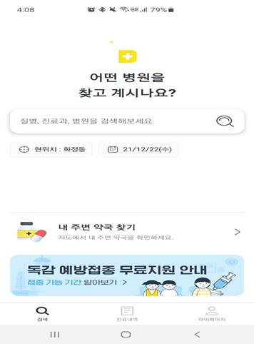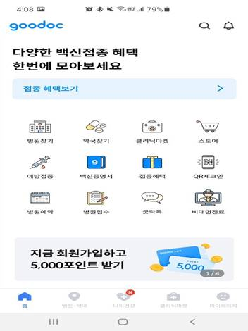

 

●   분석

 똑닥과 굿닥 모두가 병원과 약국 찾기 서비스를 제공하고 있다. 완전하게 현행 서비스를 제칠 수 있는 만큼의 프로세스를 구현하는 것은 현실적으로 무리라고 판단하여 사용자로 하여금 병원에 헛걸음을 줄일 수 있게 다수의 사용자 혹은 병원 관계자로부터 정보를 받아 실시간으로 정보를 전달하는 어플리케이션을 만들고자 했다. 특히 웹 사용자가 등록한 휴원정보를 반영하고 입력한 기준(현위치, 과, 이용시간)을 통해 병원과 약국 정보를 동시에 제공할수 있도록 구현했다.

역할 배분

| 이름   | 역할                                            |
| ------ | ----------------------------------------------- |
| 김용국 | BE(Controller,  Service, DB), sub FE(ajax)      |
| 배연철 | BE(Service,  DAO), sub FE(JavaScript), Open API |
| 김형준 | FE(JSP, CSS, JS), sub  BE(Service), 발표        |
| 최혁진 | FE(JSP, CSS, JS), sub  BE(Service), 발표        |
| 강현규 | BE(Controller,  Service, VO), sub FE(CSS)       |

 

구현 기능

\* 관련한 코드를 전부 기입하지 않고 특이한 아이디어가 개입된 코드의 경우만 기입

사용 기술 : Spring Framework (eclipse), mybatis, mySQL, Naver Cloud Platform API(MAP, ChatBot), 공공데이터 포털 Open API(병원, 약국), JSP, JavaScript, ajax, CSS

 

●   회원 관리

○   로그인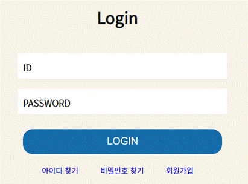

 

입력:아이디(직접입력), 패스워드(직접입력)

 

출력 : 

1.아이디 패스워드 일치 시 메인 페이지로 이동

2.아이디 패스워드 불일치 시 alert 

 

과정 : 아이디와 패스워드가 입력된 값과 동일한 레코드를 찾고 존재하면 세션에 저장

 

○   회원가입, 삭제

입력 : 아이디, 패스워드, 패스워드 확인, 이름, 닉네임, 생년월일, 휴대폰 번호, 이메일, 주소

출력 : 이 중 하나라도 입력이 되지 않을 시 alert, 각각의 중복확인을 통해 겹치면 안되는 정보를 입력 회원가입 완료 시 로그인 페이지

과정 : 회원가입란을 통해 사용자로부터 필수 정보들을 입력 받고 이를 DB에 저장하여 차후에 로그인시나 로그인이 필요한 서비스에서 확인할 수 있게 함

 

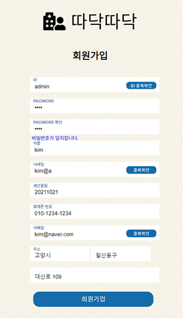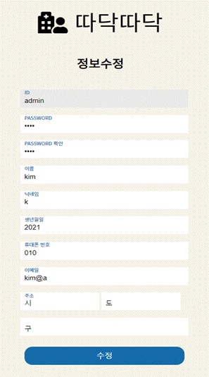

○   회원정보 수정

입력 : 회원가입과 동일한 입력( 기존 정보가 기입됨)

출력 : 수정 완료 시 메인페이지

과정 : 아이디 이메일 생년월일을 제외한 모든 정보를 수정할 수 있음.

 

○   회원 아이디 및 패스워드 찾기

입력 : 이름, 이메일, 생년월일

출력 : 확인 정보가 있으면 각각의 아이디나 비밀번호를 출력, 없으면 alert

과정 : 이름과 이메일 생년월일과 같은 수정할 수 없는 정보들을 기반으로 DB의 회원 테이블에서 정보를 찾고 이와 동일한 정보가 있으면 아이디나 패스워드를 찾아주고, 없으면 alert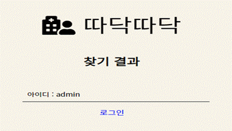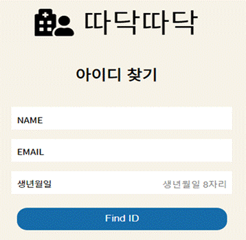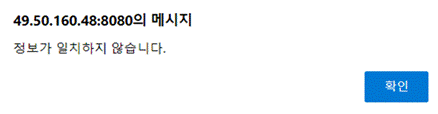

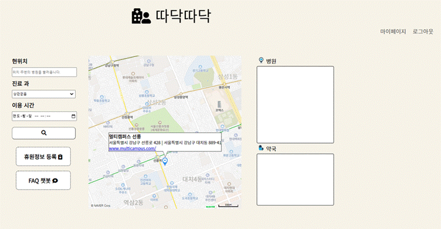

●   병원, 약국찾기

○   병원 찾기

입력 : 위치 정보(도로명, 지번주소 : 직접입력), 진료 과 (선택입력 : 상관없음, 소아청소년과, 이비인후과, 치과, 안과, 피부과, 내과, 기타), 이용시간 (달력 시각 선택)

출력 : 병원 이름, 병원에서 담당하는 진료 과, 진료 시간, 현위치와의 거리, 병원 상세 정보 a태그, 근처 약국 찾기 버튼

 

과정 : 병원 찾기는 공공데이터 포털의 전국 병의원 찾기 Open API를 사용한다. 서비스 중 해당 위치 정보(위도와 경도)를 알고 있으면, 그 주변의 병원들의 정보를 원하는 만큼 보여준다. 도로명을 Naver Map API geocoding를 이용하여 입력 받은 현 위치값으로 위도와 경도를 구한다. 구해낸 위도와 경도 값으로 병원 리스트를 뽑아내고 각 병원에게 부여된 HPID 값을 뽑아낸다. HPID 값으로 병원 상세정보에서 원하는 정보와 비교하여 조건에 부합한 것만을 리스트로 뽑아내고 이 리스트가 10개가 되면 더 이상 출력되지 않도록 한다.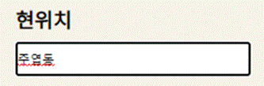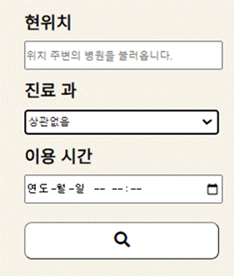

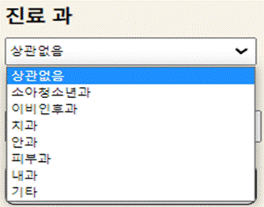

 

 

 

 

○   병원 상세 정보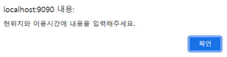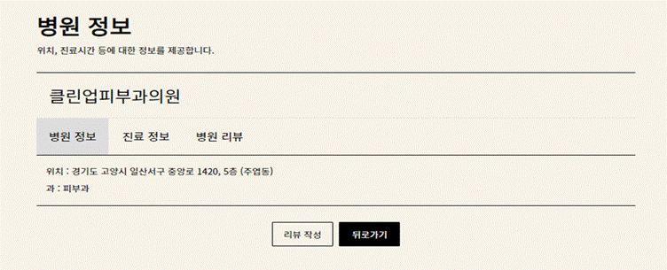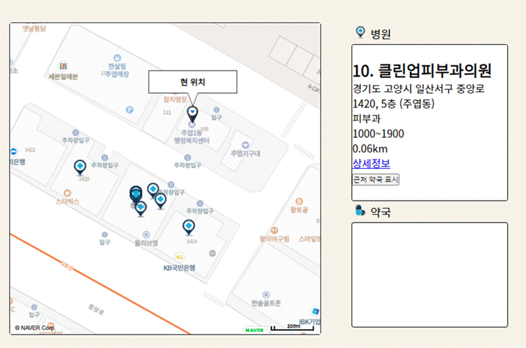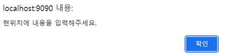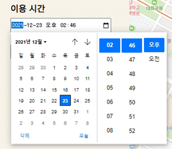

입력 : 병원 리스트에서 생성된 병원 상세 정보 태그

출력 : 병원 정보, 진료 정보, 병원 리뷰

과정 : 리스트를 얻었을 때 참고한 병원 상세정보들을 병원 상세 정보 페이지에서 가독성을 높여서 출력, 병원 리뷰에는 사용자가 직접 리뷰를 작성할 수 있게끔 함

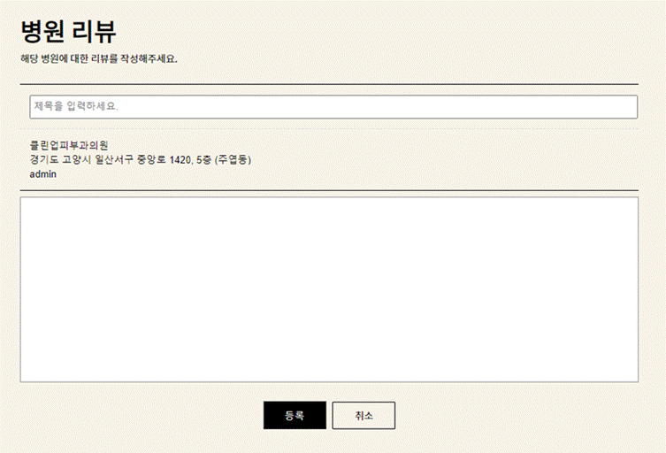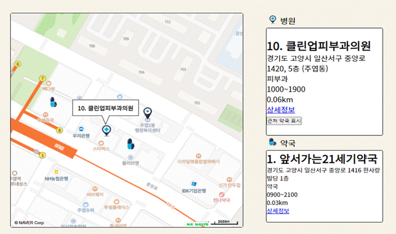

○   약국 찾기

입력 : 병원 찾기란에 생성된 리스트에 각 병원마다 생기는 주변 약국 찾기 버튼, 리스트에 나온 병원 상세 정보에 있던 위도와 경도 정보 

 

출력 : 약국 이름, 오픈시간, 거리, 약국 상세 정보 태그

 

과정 : 병원찾기와 동일한 과정을 거친다. 대신 약국의 경우 3개가 되면 더 이상 출력되지 않도록한다.

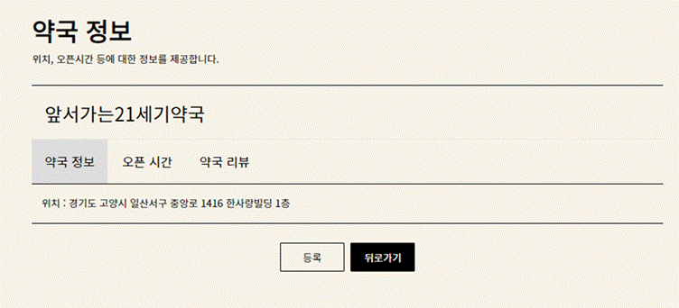

○   약국 상세 정보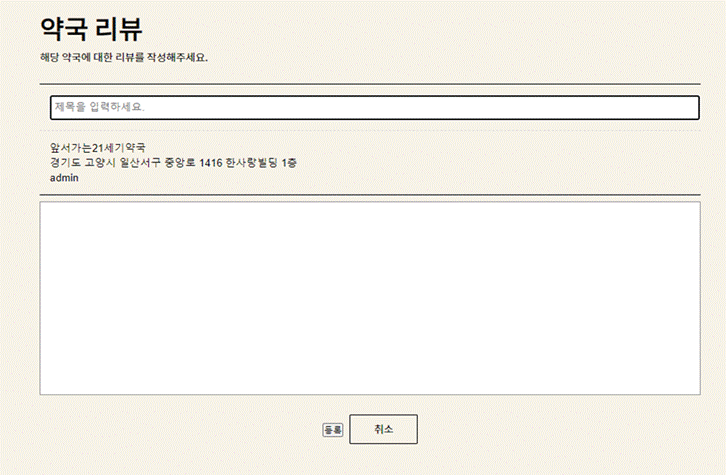

입력 : 약국 리스트에 생성된 약국 상세 정보 태그

출력 : 약국 정보, 오픈시간, 약국 리뷰

과정 : 병원 상세정보와 유사하게 구성, 리뷰게시판을 만들어 사용자로부터 약국에 대한 의견을 받을 수 있음

 

○   MAP API (위도 경도 구하기)

입력 : 도로명이나 지번주소

출력 : 위도, 경도

과정 : Naver Cloud Platform에서 제공하는 Geocoding 예제를 이용하고, 병원 찾기, 약국 찾기, 마커 표시 등에 쓰임

 

○   MAP API (마커)

입력 : 입력 받은 현위치의 위도, 경도, 조건에 부합하는 병원 약국 위도 경도

출력 : 맵에 다중 마커 (클릭시 이름 띄움)

과정 : 메인페이지에 처음 접속했을 때 기본 위치에서 마커를 이용해 정상 작동 확인, 병원찾기와 약국찾기가 각각 완료 되었을 때 마커로 각 병원과 약국의 위치와 이름 표시 

●   휴원 정보

진료시간 외에 개인사정으로 휴원하는 경우를 등록

내가 쓴 휴원정보 목록 출력

내가 쓴 휴원 정보 수정 및 삭제

등록된 휴원정보는 병원 찾기 조건에 반영된다.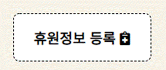

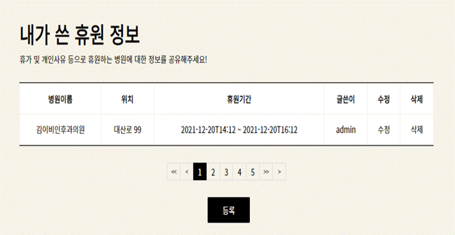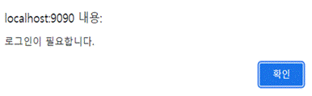

●   챗봇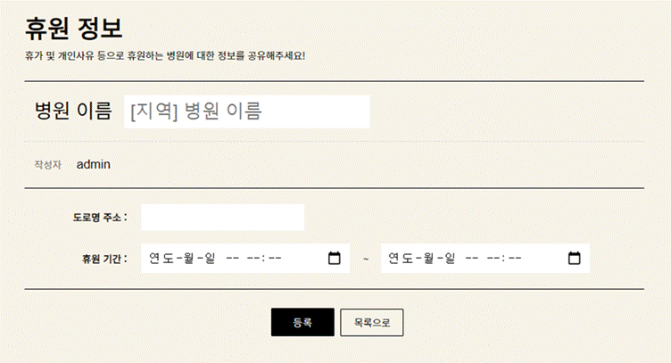

​      기능 관련 질문에 대한 응답

​      없는 질문 시 ‘올바르지 못한 질문입니다. 질문을 다시입력해주세요’ 라고 응답  

해당 응답은 텍스트와 함께 음성도 출력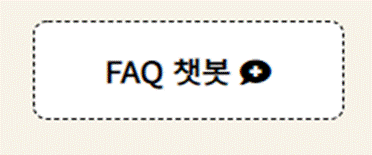 

|      |                                     |
| ---- | ----------------------------------- |
|      | 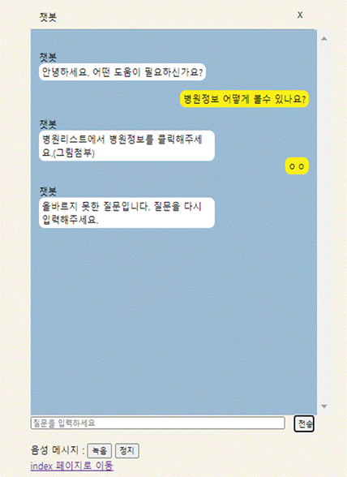 |

 

 

 

기능 한계 및 개선 방향

\* 개선방향은 아이디어 위주, 실제 적용과는 괴리가 있을 수 있음

●   회원 관리

○   기능 한계

​                        i.     관리자 계정과 사용자 계정의 분리

 많은 사용자의 이용뿐만 아니라 사용자들의 신뢰도에 따라 품질이 결정되는 서비스인 휴원 정보는 불량사용자가 등장했을 때 큰 타격을 입을 수 있다. 따라서 사용자 계정을 관리할 수 있는 관리자 계정으로 불량 사용자에 대한 제재나 경고 조치 등을 취할 수 있도록 해야 함

 

​                       ii.     병원에 직접적인 관계자 계정 추가

 이용자에 대한 신뢰도는 서비스와 직결되는 문제이기 때문에 이용자들끼리 형성된 공감대로 그들의 신뢰도를 측정하는 것이 가장 좋으나, 분란의 여지가 생길 수 있고, 이용자들간의 평가는 참고 정도로 하고 서비스 차원에서 이를 구분해주는 역할을 할 필요성이 있음

 

​                      iii.     주소와 연계성 있는 기능 구현

 현 서비스에서는 주소가 직접적으로 관여해 정보를 보여주는 기능은 구현되지 않았음. 그러나 로그인이 되어 있는 환경에서는 사용자의 위치를 파악하여 미리 병원 위치를 표시해주는 것이 사용자로 하여금 편리할 것. 

 

​                      iv.     패스워드 찾기 보안강화

 패스워드를 찾거나 아이디를 찾는 등의 회원관리에서 그대로 아이디와 패스워드를 노출하기 때문에 이를 개선할 필요가 있음. 

 

○   개선 방향

​                        i.     관리자 계정과 사용자 계정의 분리

다 계층 DB를 구현하여 계정간의 정보를 달리 함

 

​                       ii.     병원에 직접적인 관계자 계정 추가

다 계층 DB를 구현

 

​                      iii.     주소와 연계성 있는 기능 구현

맵 표시 시에 사용자의 주소 데이터를 불러와서 맵과 병원 찾기의 과정을 거쳐서 표시 (메인페이지 불러오는게 늦어질 수 있음)

 

​                      iv.     패스워드 찾기 보안강화

패스워드 찾기는 패스워드를 찾아주는 것이 아니라 이메일을 통해 랜덤 문자열 비밀번호를 보내는 등의 보안 강화를 위한 로직을 구성하거나 OAuth2.0과 같은 프레임워크를 사용

 

●   병원, 약국 찾기

○   기능 한계

​                        i.     마커가 서로 겹칠 시 구분이 힘듦

 마커 자체를 제공해서 시각적인 효과를 높여서 사용자로 하여금 금세 본인 주변의 병원들을 파악할 수 있게 하였으나, 마커들이 서로 겹쳐있을 때 커서로 가리켜도 구분하기 쉽지 않았음. 줌인을 하는 번거로움 발생

 

​                       ii.     실제 사람이 이동하는 거리와 괴리가 있음

 리스트에서 제공되는 거리는 현위치와 병원, 약국간의 직선거리임. 따라서 도로가 주변에 많지 않은 환경에서는 적절할 수도 있겠으나, 도심과 같이 도로나 많은 장애물들이 혼재한 경우 부적절할 수 있음.

 

​                      iii.     리스트 정보들의 가독성이 좋지 않음

 병원이나 약국의 리스트를 단순히 나열만 한 수준으로 폰트의 크기와 배열을 수정할 필요가 있음

 

​                      iv.     GPS 기능 미구현

 사용자가 현주소를 모르더라도 버튼 클릭만으로 현재위치를 입력란에 기입할 수 있는 기능이 필요함.

 

​                       v.     휴원 정보를 메인페이지에서 받아볼 수 없음

 휴원 정보는 병원을 찾고 병원 상세페이지에서 확인할 수 있음. 핵심적인 기능으로 다수의 사용자가 생길수록 중요하게 작용할 것으로 보이는 기능을 전면에 내세울 필요가 있음.

 

​                      vi.     검색 기록이 저장되지 않음

 모든 정보를 서비스에서 제공할 수 있으면 좋겠으나, 현실적으로 불가능 따라서 웹을 이리저리 옮기거나 하는 등의 계속해서 한 페이지에 머무를 수 없는 환경이 조성될 가능성이 매우 높음. 매번 똑같은 내용을 직접 치는 번거로움을 줄여 편의성을 개선할 필요성이 있음

 

○   개선 방향

​                        i.     마커가 서로 겹칠 시 구분이 힘듦

 마커를 표시할 때 마커의 특성을 조절하는데 이 때 마커에 커서를 올려놓으면 마커의 색이 변하는 함수를 제작하거나, 커서가 가리키는 마커는 자동적으로 마커의 내용을 보여주는 함수를 제작

 

​                       ii.     실제 사람이 이동하는 거리와 괴리가 있음

 실제 사람이 이동하는 방법들을 고려한 거리 측정을 하는 API등을 활용(도보, 대중교통, 자전거, 택시, 지하철 등)

 

​                      iii.     리스트 정보들의 가독성이 좋지 않음

 가장 핵심적이거나 우선순위를 정해서 폰트의 크기와 색 등을 조절해 가시성을 높이는 전략을 접목

 

​                      iv.     GPS 기능 미구현

 IP주소등을 분석해서 사용자의 위치 주소를 추출할 수 있음. (다소 부정확하다는 의견이 있어 보정이 필요할 것으로 보임)

 

​                       v.     휴원 정보를 메인페이지에서 받아볼 수 없음

 휴원 정보를 참조하여 사용자가 원하는 시간대에 부합하지 않는 경우에는 회색이나 다른 비활성화 표현으로 표시해서 병원정보에 간략하게 보여주는 전략을 취하는 방법.

 

​                      vi.     검색 기록이 저장되지 않음

 검색 기록을 DB에 저장하고 이를 자동완성과 비슷한 기능 구현

 

●   휴원정보

○   기능 한계

​                        i.     휴원 정보는 누구나 등록 가능, 그러나 병원 관계자와 일반 유저간의 차이를 구분할 수 없음 

 병원 관계자와 일반 유저의 차이는 사용자에게 큰 신뢰도 차이를 줄 것.

 

​                       ii.     휴원 정보 등록 시 정보에 신빙성을 줄 증거가 부족함

 유저들이나 관계자가 적는 내용에 신빙성이 없으면 그 자체로 존재 이유가 퇴색됨.

 

○   개선 방향

​                        i.     휴원 정보는 누구나 등록 가능, 그러나 병원 관계자와 일반 유저간의 차이를 구분할 수 없음

 병원 관계자와 일반 유저를 다계층형 DB 구성으로 회원을 나누고 휴원 정보가 발생했을 때 이를 출력할 때 인증마크를 출력하여 시각적으로 보이게 하고, 마크에 커서 가리킴 혹은 클릭 시 증거 정보를 제공하는 형태 구현.

 

​                       ii.     휴원 정보 등록 시 정보에 신빙성을 줄 증거가 부족함

 등록할 때 사진 정보를 같이 제공하거나, 등록자의 거주 여부 등을 확인해 주는 것.

 

●   챗봇

○   기능 한계

​                        i.     정해진 질문에만 답변을 얻을 수 있음

 챗봇의 주 기능은 사용자의 자연스러운 물음에 있는데 이를 현저히 저하시키는 결과를 초래함.

 

​                       ii.     병원 찾기 기능과 연동되지는 않음

 사용자에게 서비스 사용법에 대한 간략한 내용들을 제공해주더라도 사용자의 페이지 이동이 빈번해져 번거롭게 만듦. 또한 기능간의 연계성은 사용자의 서비스 이용에 큰 도움을 줄 것으로 보임.

 

​                      iii.     새로운 페이지에 옮겨져 병행하기 어려움

서비스를 사용하던 중 이해하기 어렵거나, 사용법을 모르는 경우 사용할 수 있어야 함.

 

​                      iv.     한정적인 입력기능 탑재

사용자의 상황을 고려하지 않고, 오직 텍스트로만 질문이 가능하게끔 되어있음.

 

 

○   개선 방향

​                        i.     정해진 질문에만 답변을 얻을 수 있음

 대화모델빌드를 이용하여 다양한 질문에 대응하는 방법도 있지만, 이 방법은 더 많은 비용이 발생하게 되기 때문에 훨씬 많은 수의 질문을 대비해서 빠른빌드로 경제적으로 구현하는 방법도 있음.

 

​                       ii.     병원 찾기 기능과 연동되지는 않음

 시나리오를 작성하여 빌드 작성 시 유사한 형태로 제공할 수 있음.(실제 서비스는 아님.)

 

​                      iii.     새로운 페이지에 옮겨져 병행하기 어려움

 따로 섹션을 할애하여 챗봇만의 구역을 확보. 혹은 버튼 클릭시 뒷 화면은 그대로 둔 채 켜고 끌 수 있는 형태의 팝업을 생성(유튜브의 PIP, 네이버 papago의 미니 등과 유사)

 

​                      iv.     다양한 고객 유저분들의 입력방식을 고려해야함

노년층이나 장애인과 같이 텍스트로 입력이 힘든 고객들을 위해 다른 입력방식을 고려해야함. 예를들어, 수화 방식의 챗봇이나 음성으로 입력이 가능한 챗봇과 같은 기능들을 포함시켜야함.

 

 

●   기타

○   개선 방향

​                        i.     전반적인 디자인 개선

 유저들의 마우스 커서 이동동선을 고려한 디자인 개선.

 

결론

●   요약

 우리나라의 전반적인 생활수준 향상과 전세계적으로 큰 질병으로 인한 언택트의 삶을 필요했고 언택트를 넘어 아날로그에서 디지털로 전환하는 온택트의 요구가 급증한 시대적 배경에 입각한 빠르고 쉽고 적절한 병원과 약국을 찾아주는 웹 어플리케이션을 만들고자 했다. 

 공공데이터 포털의 전국 병원과 약국 정보들을 재 가공하여 사용자 입력한 위치 주변에 있는 대상들을 찾아 주었고, 맵에 마커표시를 통해 사용자들이 보다 쉽게 위치를 확인할 수 있게 구성하였다. 또한 회원에 한해서 휴원 정보 등을 등록할 수 있었으며, 이 휴원 정보는 거듭된 사용자들의 사용으로 더 정확하고 고품질의 정보들을 받아볼 수 있게 될 것이다. 또한 챗봇을 이용하여 서비스를 이용하기 힘든 사용자들에게도 서비스 품질을 누릴 수 있는 기회가 제공될 것이다. 

 첫 버전으로 미흡한 부분들이 많이 제기되었고, 개선방향의 대부분이 로직 개선이나, 시스템 개선에 치중된 만큼 이를 개선해서 버전업 해나간다면 충분히 좋은 웹 서비스로서 기능할 수 있을 것이다. 

 

●   기대효과 - 성장가능성

a.   더 고도화된 챗봇을 이용하면 몸이 불편한 사람들과 같이 입력장치를 쓰기 어려운 사람들도 쓸 수 있는 웹 애플리케이션의 잠재성을 가짐.

b.   단순한 치료 목적을 넘어서서 본인의 자기관리로의 개념도약을 기대해볼 수 있음.

c.   더 나아가 자기관리로써 웹 애플리케이션을 쓰게 된다면 사용자 스스로 수동적인 치료에서 주도적인 치료로 전환되고 이로인해 고품질의 서비스를 효율적으로 받을 수 있음.

d.   병원에 있는 로컬 영역의 데이터도 받아올 수 있게 된다면 대기 인원이나 진료 소요 시간 등으로 지금보다 효율성과 경제성 면에서의 상승을 기대해 볼 수 있음.

 

●   각 팀원 느낀점

김용국 : 이번 프로젝트에서는 팀장 역할과 백엔드, 프로젝트 총 통합 역할을 했다. 특히 통합 역할이 굉장히 힘들었다. 프론트와 백엔드를 나누어서 작업을 하다보니 의사소통이 안된 부분을 해결하는게 제일 힘들었다. 덕분에 협업시 주의사항들을 알게 되었다. 그리고 각자의 역량을 파악하고 팀프로젝트를 했었다면 더 효율적인 프로젝트가 되었을 텐데 이 부분이 아쉬웠다. 다음에 또 다른 프로젝트를 하게 된다면 더 효율적인 프로젝트를 진행 할 수 있을것 같다.

 

배연철 : 팀프로젝트가 거듭되면서 부족함을 많이 느꼈던 시간이었다. 만들고자 하는 이상은 큰데 그걸 담당하고 구현해야 하는 문턱에서 수도 없이 좌절했던 것 같다. 비록 완벽하게 만들지는 못했고, 우리가 원했던 웹 애플리케이션보다 다소 부족한 제품을 제작했지만 끝까지 해냈다는 성취감이 더 큰 것 같다. 만드는 과정에서 서로 소통이 되지 않아서 서로 존대는 하지만 날을 세웠던 것을 반성하고, 이를 받아준 팀원들에게 감사하다. 이번 프로젝트는 완성품도 완성품이지만 기능 한계와 개선 방향에서 우리가 무엇을 만들고자 했는지를 보여주는 것 같고 한 목표를 위해 같이 내달렸던 팀원들의 노고가 보이는 듯해서 뿌듯하고 감사하다.

깃헙 주소 : gitHub.com/bayech

 

김형준 : 팀프로젝트의 시작부터 막막했습니다. 내가 팀에서 맡을 수 있는 역할이 없을거라고 생각했고, 실제로 한 부분을 맡기에는 많이 부족했습니다. 결국 FE 파트를 맡아서 프로젝트를 진행하기 시작했습니다. 많은 것을 배울 수 있는 시간이었습니다. 코딩 실력이 극적으로 늘어나거나 그러지는 않았다. 그냥 조금 더 내가 생각하는 데로 구조를 잡는게 수월해졌을 정도라고 생각합니다. 팀으로 프로젝트를 진행하면서 미안한 감정을 정말 크게 느꼈습니다. 뭔가 나의 역할은 전혀 없고 내가 묻어 가려고만 한다는 생각에 너무 죄송하고, 감사했고, 또 스스로에게 자극을 주는 좋은 기회가 됬던 것 같습니다. 앞으로는 어떤 프로젝트에 참여하더라도 내가 한 사람의 역할을 할 수 있게 나의 역량을 키워야겠다는 목표를 가지게 됬습니다. 그냥 취업을 위해 역량을 키운다기보단 무엇인가를 같이 해나갈 수 있는 사람으로 거듭나기 위한 역량을 키우고 싶습니다. 조원 분들에게 다시 한 번 감사의 말씀을 드리면서 팀프로젝트를 마무리하겠습니다.

 

 

최혁진 : 프로젝트를 시작하기 앞서서 스프링에 대한 이해도가 낮아, 팀원들한테 의지한 분야가 많았습니다. 허나, 팀원들의 코치와 도움으로 이번 프로젝트를 하면서 웹 어플리케이션에 대한 이해도가 더욱더 성장을 한거 같습니다. 이번 계기로 네이버클라우드와 챗봇에 대한 이해도가 더 향상되어 왔고, 앞으로 들어갈 개발자 팀에서 무리 없이 클라우드 시스템을 활용할수 있는 자신감이 생겼습니다. 뿐만 아니라 수업시간에 배운 내용하고 이렇게 팀프로젝트를 함으로써, 스프링 활용도를 더욱 이해한거 같습니다. 만약에 자원과 시간이 충분하다면, 완성품에 가까운 프로젝트를 해보고 싶은 생각이 많이 들었습니다. 저희 조가 다른조에 비해 아이디어 내는데에 시간을 많이 허비해 시간적으로 많이 부족하였으나, 팀원들의 활약으로 어느정도 완성도가 있는 프로젝트를 완성했습니다. 전체적인 그림에서 제가 한게 별로 없는거 같아서 팀원들한테 미안함이 많지만, 이 프로젝트로 자기자신의 역량을 조금 더 알아본 계기가 된거같습니다. 앞으로 있을 팀프로젝트에서는 더 나은 실력으로 팀원들한테 도움이 되는 개발자가 되는것을 목표로, 이번 프로젝트에 기여를 많이한 다른 팀원들한테 감사함을 표합니다. 

깃헙 주소: github.com/sc62070

 

강현규 : 멀티캠퍼스에 입학하고 처음으로 접하는 코드들이 너무 어려워 따라가기만 급급했지만 처음하는 프로젝트는 신선하고 재밌었습니다 기본적인것도 구현하기힘들었지만 조원들의 도움으로 프로젝트를 하는 방법과 방식 api 나 스프링에대한 이해도가 조금은 올라간거같습니다. 프로젝트에서 한건많이없지만 잘이끌어 주시고 이해해주신 조원분들이 너무 고마울 따름입니다 저도 더욱 열심히 공부하고 노력해서 지금조원분들처럼 다른분들을 이끌어줄수있는 실력자가 되도록 노력해야겠다고 생각하였습니다 조원분들 모두 취직 잘하실걸 알지만 화이팅하시고 저는더 노력해서 얼른 뒤따라가겠습니다 감사합니다.!

 

참고자료 및 회의자료

●   아이디어 회의자료

○   https://gitmind.com/app/doc/fa2809efc36f44cd1804b4b5b966d570

●   일정관리

○   [WBS](https://docs.google.com/spreadsheets/d/1yhoqqcfYHeBAAwZfJauhKBIfSHekVYzk02yUMmVMLhY/edit#gid=1801751892)

●   피드백 관리

○   [피드백](https://docs.google.com/document/d/1sMpEg205QDxuk8vbFuyLquK1Qj-najVisCsdzvPu_aA/edit)

●   챗봇 질문 답변

○   [질문 답변](https://docs.google.com/spreadsheets/d/1NJt0shln92tClU4g6miSlHxHow1RB7Zs3O22pVf4vp0/edit#gid=0)

●   데이터 제공

○   공공데이터포털(data.go.kr)

■   국립의료원_전국 병의원 찾기 서비스

■   국립의료원_전국 약국 정보 조회 서비스

○   Naver Cloud Platform

■   MAP v3

■   CLOVA ChatBot

●   참고 서적

○   자바 웹을 다루는 기술 - 이병승, 길벗

○   이것이 오라클이다 - 우재승, 한빛미디어

○   이것이 자바다 1,2 - 신용권, 한빛미디어

○   다양한 봇빌더를 이용한 똑똑한 챗봇 만들기 - 정임수, 영진닷컴

○   모두의 네트워크 - 미즈구치 카츠야, 길벗

○   HTML5 웹 프로그래밍 입문 - 윤인성, 한빛아카데미

●   참고 사이트

○   docs.oracle.com - 자바 관련

○   developer.mozilla.org - JavaScript, CSS 관련

○   [navermaps.github.io/maps.js/docs/tutorial-2-Marker.html](https://navermaps.github.io/maps.js/docs/tutorial-2-Marker.html) - 네이버 마커

○   api.ncloud-docs.com/docs/ai-naver-mapsgeocoding-네이버맵위도,경도

 

 

 

 

 

 