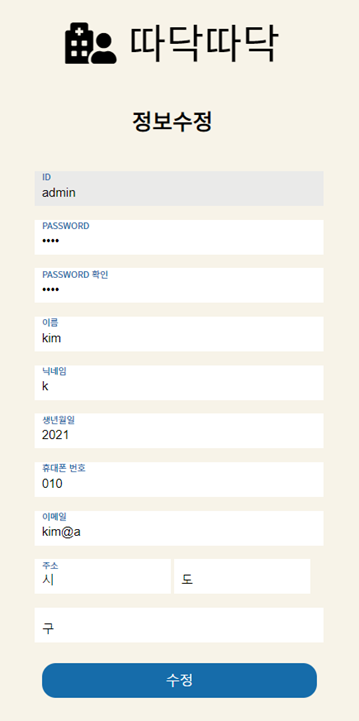
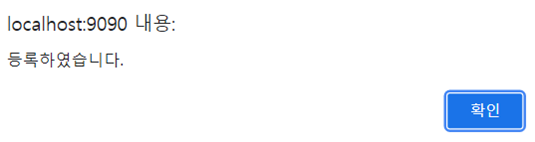

[TOC]

[1. 회원관리](#1. 회원관리)

[5. 기타](#5. 기타)

# 1. 회원관리

## 1-1  회원가입

* 중복확인(ID, 닉네임, 이메일) 

* 비밀번호일치 확인 

* 모두 기입 안하고 회원가입 누를 시 -> alert

* 모두 기입 하고 회원가입 누를 시-> DB에 insert -> 로그인 페이지로 이동

* 위에 로고를 누르면 메인 페이지로 이동 

                            

 

## 1-2 로그인

* 로그인 페이지

         

* 로그인 성공 시 alert 후 메인 페이지로 이동

        

                    

* 로그인 실패 시 alert

        

 

## 1-3 아이디 찾기

* 아이디 찾기 페이지

                    

* 정보 일치 시 아이디 출력
* 로그인 페이지 링크

             

 

* 정보 불일치 시 alert

       

## 1-4 **비밀번호 찾기**

* 비밀번호 찾기 페이지

   

* 정보 일치 시 아이디 출력
* 로그인 페이지 링크

  

 

* 정보 불일치 시 alert

         

## 1-5 회원정보 수정

* 메인페이지 우측 상단 메인페이지를 누르면 회원정보 수정 페이지로 이동

                 

                                

* 수정 성공 시 alert 후 메인 페이지로 이동

    

                  

 

# **2.**  **병원찾기**

* 메인페이지에 위치

                  

 

## **2-1 입력(현재위치, 과, 이용시간)**

* 다 입력을 해야 작동함

              

* 하나라도 입력을 안할 시 alert

             

* 현위치 입력

     

* 과 선택(자주 사용하는 의원을 설정하고 나머지 과들은 기타, 과에 상관없이 찾고 싶으면 상관없음)

          

* 이용 시간

              

 

## **2-2 병원리스트 출력 및 맵 마커 표시**

* 입력 조건에 맞는 병원이 없을 시 alert

        

 

* 입력 조건에 맞는 병원을 최대 10개 까지 출력(거리순) 
* 맵에 병원, 현재위치 마커 표시
* 병원 상세정보 페이지 링크
* 병원 근처 약국 표시 버튼

                      

* 병원 근처 약국 표시 버튼 눌렀을 시 해당병원 기준으로 약국 3개가 출력(거리순)
* 맵에 약국을 마커 표시
* 약국 상세정보 링크

                    

## **2-3 병원 상세정보**

* 병원리스트에서 상세 정보 클릭하면 해당 병원 상세정보 페이지로 이동
* 병원 정보, 진료 정보, 병원 리뷰로 구성
* 리뷰작성 버튼(리뷰작성 페이지로 이동)
* 뒤로가기 버튼(메인페이지로 이동)

* 병원 정보(위치, 과)

                

* 진료 정보(진료 시간)

                       

* 해당 병원 리뷰 목록 출력

                  

* 리뷰작성 페이지
* 제목, 내용 작성
* 자동으로 병원 이름, 주소, 작성자 작성됨 수정 불가
* 등록 버튼
* 취소 버튼(병원 상세정보 페이지로 이동)

                     

* 병원 리뷰 등록 시 alert

* alert 후 병원 리뷰 페이지로 이동

                     

 

* 약국 상세페이지도 병원 상세 정보 페이지와 동일

               

                      

                

                      

                    

 

# **3.**  **휴원 정보 등록**

* 메인페이지 휴원정보 등록 버튼에 링크

      

* 로그인 안되있을 시 alert 후 로근인 페이지로 이동

      

                  

* 로그인 됐을 시 내가 쓴 휴원 정보 페이지로 이동
* 내가 작성한 휴원정보 목록 출력
* 수정
* 삭제
* 휴원정보 등록 페이지 링크 버튼

              

 

* 휴원 정보 등록 페이지
* 병원이름, 도로명 주소 직접 입력
* 작성자 자동 입력됨, 수정 불가

                  

               

* 등록에 성공시 alert 후 내가쓴 휴원정보 페이지로 이동

      

              

 

* 휴원이 반영전
* 휴원정복 등록 전 ‘1. 한사랑김수련산부인과의원’ 이 출력이 됨

                  

* '한사랑김수련산부인과의원’ 휴원정보 등록

                   

* 휴원정보 등록 후 ‘1. 한사랑김수련산부인과의원’ 이 출력이 안됨

                 

 

# 4. 챗봇

* 메인페이지 왼쪽아래 FAQ 챗봇 버튼 누를 시 챗봇 페이지로 이동
* TTS(Text to Speech), STT(Speech To Text) 지원

    

* 챗봇 페이지로 이동하면 챗봇이 문자, 음성으로 인사말을 출력
* 기능에 대한 질문 응답

                            

* 등록된 질문 시
* 문자, 음성으로 응답 출력

                                

* 없는 질문 시
* 문자, 음성으로 응답 출력

                                

# 5. 기타

* 로고를 누르면 메인 페이지로 이동

 